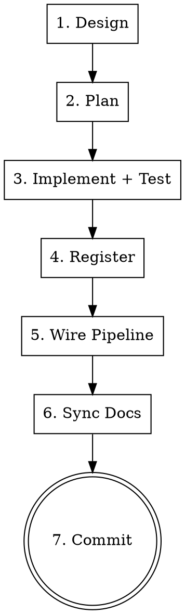

# Add Plugin — Intelligence Plugin Development

## Overview

Rigid gate-by-gate process for adding a new intelligence plugin. Each gate must complete before the next begins.

## Process



### Gate 1: Design
Use `superpowers:brainstorming` skill. Write design to `docs/plans/YYYY-MM-DD-<name>-design.md`. Get user approval.

### Gate 2: Plan
Use `superpowers:writing-plans` skill. Write plan to `docs/plans/YYYY-MM-DD-<name>.md`.

### Gate 3: Implement + Test
Use `superpowers:test-driven-development` skill. Reference `plugin-reference` skill for:
- Correct tier directory and naming prefix
- Plugin protocol (`compute_full` / `compute_next`)
- `frames` dict structure and available keys
- Test file convention

**Hard gate:** `python -m pytest tests/unit/ -q` must pass with 0 failures before proceeding.

### Gate 4: Register
In `src/intelligence/register_plugins.py`:
1. Add import: `from .<tier>.<module> import plugin as <alias>_plugin`
2. Add registration: `registry.register_pattern(<alias>_plugin)` (or `register_indicator` for I1)

### Gate 5: Wire Pipeline
Use `wire-pipeline` skill. Follow all 7 steps including the `next build` verification.

**Skip this gate** if the plugin doesn't need dashboard visualization (e.g., internal-only plugins).

### Gate 6: Sync Docs
Run these commands to get current counts:
```bash
python -c "
from src.intelligence.register_plugins import register_all_plugins
from src.intelligence.plugins import registry
register_all_plugins()
print(f'Indicators: {len(registry.indicators)}')
print(f'Patterns: {len(registry.patterns)}')
print(f'Total: {len(registry.indicators) + len(registry.patterns)}')
"
python -m pytest tests/unit/ -q --tb=no 2>&1 | tail -1
```

Update these files with verified numbers:
- `CLAUDE.md` — version, status line, plugin counts, tier status, completed phases, pipeline
- `docs/architecture/intelligence-tiers.md` — status, totals, tier descriptions
- `docs/development-roadmap.md` — completed list, next priority
- Auto-memory `MEMORY.md` — registry totals, test count

Commit with: `docs: update CLAUDE.md and architecture docs for <feature> (vX.Y.Z)`

### Gate 7: Commit + Push
Commit implementation and doc updates. Push to remote.
