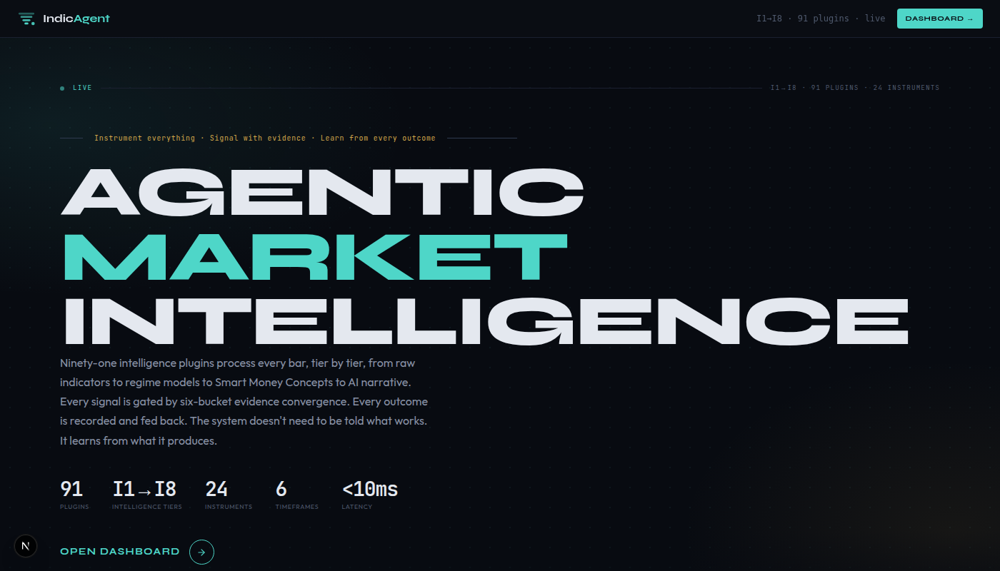
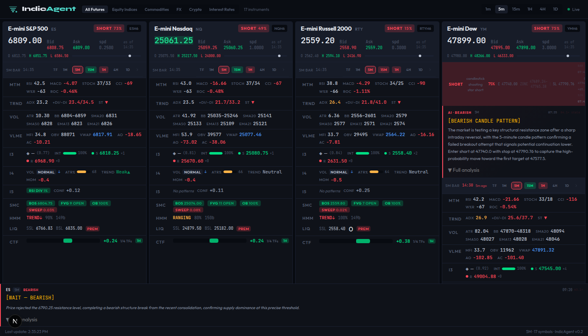

# IndicAgent Market Intelligence Platform

**Repository:** [github.com/WallStArb/IndicAgent](https://github.com/WallStArb/IndicAgent)

**Version:** v1.6 | **Status:** Operational | 96 plugins · 24 instruments · 1430 tests

> **TLDR:** IndicAgent is a real-time market intelligence platform built on a shared, durable event bus. Every tick, every signal, and every intelligence output flows through that bus. An 8-tier pipeline runs 96 plugins in a dependency-ordered DAG where each tier builds on the outputs of the tier below — raw indicators and market structure feed into adaptive statistical models (HMM, GARCH, Kalman, BOCPD) and Smart Money Concepts, which feed into cross-timeframe confluence scoring and AI narrative synthesis. Every output is encoded into a canonical typed schema, published to the bus, and persisted to a feature store, creating a learning loop where signal outcomes feed back into model weights without manual retuning. The primary goal is alpha generation: every design decision — from the CIS 6-bucket aggregator to the outcome-labeled feature store — is oriented toward identifying edges that are statistically significant, regime-specific, and improvable over time. New data domains and product layers attach as independent services that subscribe to existing streams and publish their own, with no changes to anything already running.

---





---

## The Unified Data Spine

The platform is built around a single structural decision: **the streams are the spine of everything.**

Every tick, every 1m bar, every indicator value, every intelligence signal, every AI narrative, every signal lifecycle outcome — all of it flows through one shared, durable, replayable event bus. No service calls another directly. Producers publish. Consumers subscribe. The bus is the only contract between them.

### Two buses, two roles

**DragonflyDB (Redis-compatible)** on the hot path: sub-millisecond tick ingestion and stream fan-out to all downstream services. Raw market data enters here; intelligence services consume here. No database in the hot path.

**Redpanda (Kafka-compatible)** on the warm path: durable, partitioned, replayable logs. Intelligence outputs and regime states land here. All services and consumers can subscribe.

### Durable replay from offset 0

New consumers — a new product layer, an ML model, an alert engine, a backtesting framework — bootstrap by replaying the full historical stream from the beginning. No special onboarding. No data migration. No pipeline changes. The full intelligence history is available on day one.

### Consumer groups and disconnect recovery

Messages queue on the stream. If a consumer process disconnects, messages accumulate at-least-once. On reconnect, the consumer resumes from its last committed offset — nothing is lost, nothing is reprocessed by other consumers. This is the standard consumer group model from Kafka, applied to the entire intelligence pipeline.

### Sub-10ms end-to-end latency, feed-provider bound

Hot path processing is not the bottleneck. From tick ingestion to intelligence signal on the stream: under 10ms per bar per symbol per timeframe. The bottleneck is the data feed provider. The pipeline is designed to normalize inputs from multiple providers under a single orchestrating process, so switching or adding a data source does not affect anything downstream.

### The bus is the contract

Producers publish typed `IntelligenceEvent` schemas. Consumers subscribe. The typed `IntelligenceEvent` Pydantic model is the interface between all services — not HTTP calls, not shared databases, not function imports. Zero coupling between services. This is how institutional quantitative funds structure their data infrastructure: not because it is fashionable, but because it is the only architecture that scales across data domains, product boundaries, and time.

---

## What Makes This Different

Most market intelligence systems are monolithic pipelines: one process reads prices, computes indicators, and emits signals. That works at small scale. It breaks at production scale — hard to debug, harder to extend, impossible to reason about under load.

IndicAgent is built around three architectural principles that solve the hard problems directly.

### 1. Directed Acyclic Graph (DAG) execution — dependency ordering without chaos

**The problem:** 91 plugins across 8 tiers. RSI must complete before RSI Divergence reads it. HMM regime must complete before the CIS scorer gates on it. In a naive system, you manage execution order manually — and one wrong dependency creates silent data corruption or a circular loop that hangs the pipeline indefinitely.

**The solution:** Every plugin declares its inputs. The DAG engine runs Kahn's topological sort at startup, producing a guaranteed valid execution order. Cycles are impossible to introduce — the engine detects them and hard-crashes at startup, not silently at runtime. Adding a new plugin means declaring its dependencies; ordering is inferred automatically.

The result: a pipeline that always moves forward, where every computed value has clear lineage back to raw OHLCV data, and where execution order is a property of the dependency graph — not a convention someone has to remember.

```
Raw OHLCV
  └─► I1 Indicators (24 plugins, no dependencies)
        └─► I2 Composite Events (depend on I1)
  └─► I3 Structure (reads OHLCV directly)
        └─► I4 Context / Regime (reads I3 + OHLCV)
  └─► I5 Patterns (reads I1 features)
  └─► I6 SMC + Confluence (reads I1–I5, cross-timeframe)
        └─► I7 Setups (reads I2–I6, regime-gated)
              └─► I8 AI Narrative (reads I7 signals)
```

→ [DAG Execution](docs/concepts/dag-execution.md)

### 2. Microservices over streams — isolation without coupling

**The problem:** A monolithic process that computes indicators, detects patterns, scores setups, tracks signal lifecycle, and generates AI narratives is operationally fragile. Restart the process to deploy a new plugin and you lose in-flight state of every open signal. A bug in the AI narrative step causes backpressure that delays indicator calculation. Scaling one stage means scaling all of them.

**The solution:** Each stage is a separate process that reads from Redis streams and writes to Redis streams. No service calls another service directly — there are no HTTP calls between services in the pipeline.

This means: restarting `market_analysis_service` to deploy a new I5 pattern plugin has zero effect on `signal_lifecycle_service` tracking open trades. The AI narrative service can fall behind without slowing indicator calculation. A new consumer — a Slack bot, an ML scoring model, a second dashboard — subscribes to the existing `intelligence:SYMBOL:TF` stream without any change to the producers.

The streams are the API. Services are stateless workers that consume and produce messages.

```
IBKR TWS → [DragonflyDB streams] → indicator_service
                                  → market_analysis_service
                                  → signal_generator_service → signal_lifecycle_service
                                  → feature_writer_service
                                  → ai_narrative_service
                                  → api_service → SSE → Dashboard
```

Each arrow is a Redis stream. No service knows the others exist.

→ [Data Pipeline](docs/concepts/data-pipeline.md)

### 3. Composite Intelligence Score (CIS) — signal selection under uncertainty

**The problem:** On a typical bar during an active session, 5–8 I7 setup plugins fire simultaneously — a TrendFollowing setup, a VWAPDeviation setup, and a CHoCHReversal with conflicting directions. Highest-confidence-wins is fragile: a high-confidence mean-reversion signal in a trending market still loses. Priority ordering goes stale as market regimes shift.

**The solution:** CIS aggregates evidence from the *entire* pipeline — not just the I7 plugins — into a single directional score using 6 weighted buckets:

| Bucket | Reads from | Weight |
|--------|-----------|--------|
| **Trend** | Kalman slope, trend regime, SMC trend, cross-TF alignment | 0.20 |
| **Momentum** | RSI deviation, MACD histogram, ROC, momentum bias | 0.20 |
| **Structure** | Swing pattern, BOS/CHoCH events, CHoCHReversal plugin | 0.15 |
| **Pattern** | Double top/bottom, H&S, triangle completions | 0.05 |
| **Institutional** | Order blocks, FVG activity, supply/demand zones | 0.25 |
| **Regime** | HMM hidden state probabilities, BOCPD changepoint, vol regime | 0.15 |

CIS fires only when `|score| > 0.35` **and** at least 3 of 6 buckets agree on direction. A single strong bucket cannot override the rest — cross-tier confirmation is required.

→ [CIS Scoring](docs/concepts/cis-scoring.md)

---

## Intelligence Pipeline: I1–I8

The platform is organized as **four layers**, each containing intelligence tiers. Layers give the big-picture structure; tiers show the depth. Every tier builds on the outputs of the tiers below it.

| Layer | Tiers | Role |
|-------|-------|------|
| **Layer 1: Data Foundation** | — | IBKR ingestion, 1m bar formation from ticks, multi-TF aggregation (1m→5m→15m→1h→4h→1d), stream fan-out |
| **Layer 2: Mathematical Intelligence** | I1–I4 | Raw indicators, composite events, market structure, volatility/trend/regime classification |
| **Layer 3: Pattern Intelligence** | I5–I7 | Pattern detection, Smart Money Concepts, cross-TF confluence, setup aggregation |
| **Layer 4: AI Intelligence** | I8 | LLM narrative synthesis: ZAI GLM-5 → OpenRouter → Ollama |

### Layer 1: Data Foundation

The operational foundation of the entire platform. A daemon connects to IBKR TWS and: (1) forms **1m bars from high-frequency ticks** — these bar close events trigger every downstream tier from I1 to I8; (2) publishes real-time **tick streams** for live price display; (3) a multi-timeframe aggregation service rolls 1m bars forward to 5m, 15m, 1h, 4h, and 1d — each timeframe runs its own full I1–I7 pipeline, giving every signal a multi-timeframe context.

```
IBKR TWS ──► 1m bar close events ──► I1 → I2 → I3 → I4 → I5 → I6 → I7 → I8
         └──► ticks:SYMBOL:live     (price display only)
              price:SYMBOL:latest
```

### Layer 2: Mathematical Intelligence

**I1 — Raw Indicators (25 plugins)**

The foundation of all downstream analysis. 25 technical indicators computed **incrementally** — each bar updates the indicator state without recomputing the full history. RSI, MACD, Bollinger Bands, ATR, VWAP, Supertrend, Parabolic SAR, Stochastic RSI, Chaikin Money Flow, Aroon, SMA, EMA, OBV, ADX/DI, ROC, Awesome Oscillator, Accelerator Oscillator, Donchian Channels, CCI, Williams %R, MFI, Keltner Channels, Historical Volatility, Chandelier Exit, and **HMA** (Hull Moving Average — a weighted MA designed to eliminate lag while maintaining smoothness, making it faster to react to trend changes than EMA without the noise of a raw fast MA). Every value is published to the bus once per bar per symbol per timeframe.

**I2 — Composite Events (11 plugins)**

Discrete signal events derived from I1 outputs. Rather than raw numeric values, these plugins emit structured events: MACD crossovers (bullish/bearish), RSI threshold crossings (oversold recovery, overbought rejection), Stochastic events, ADX trend strength transitions, volume surge detection, Donchian position (price location relative to channel bounds), and OBV momentum. Three recent additions deepen the momentum intelligence:

- **MomentumAcceleration**: uses second-derivative analysis on RSI, MACD, and ROC to detect inflection points *before* they complete — identifying momentum shifts at the turn, not after confirmation.
- **DerivativeOscillator**: applies rate-of-change analysis to momentum oscillators to extract the velocity and curvature of momentum shifts — useful for distinguishing accelerating from decelerating trends.
- **ExhaustionScore**: composite scoring across multiple exhaustion signals (volume, RSI extreme, reversal candlestick, ATR spike) to identify when a trend is running out of fuel — a leading indicator for regime transition.
- **AccelerationRegime**: classifies the *acceleration state* of the market (accelerating up, decelerating up, flat, decelerating down, accelerating down) — a cross-signal regime that complements the I4 volatility and trend regimes.

**I3 — Market Structure (8 plugins)**

Price action context above the indicator level. Swing high/low detection, support and resistance zones derived from historical price action, trend structure classification, **Market Profile** (volume distribution across price levels — identifies value area, POC, and thin/thick zones), session levels (prior day high/low/close, overnight levels), **Anchored VWAP** (volume-weighted average price from user-defined anchor points, typically swing highs/lows), Fibonacci retracement zones, and **SwingMomentum** — a recently added plugin that links momentum indicator readings directly to the structural swing context (e.g., is momentum confirming or diverging from the current swing structure?), giving I5 divergence plugins a richer foundation.

**I4 — Regime Classification (7 plugins)**

The statistical layer that classifies *what kind of market* the current bar exists in. Three models run in parallel:

- **GARCH** (Generalized Autoregressive Conditional Heteroskedasticity): models volatility clustering — the empirical observation that high-volatility periods tend to persist and low-volatility periods tend to persist. GARCH fits a time-varying volatility estimate to recent price returns and classifies the current bar into a volatility regime (low / normal / elevated / extreme). This gates which setup types are eligible: breakout setups require an expanding volatility regime; mean-reversion setups require a contained one.

- **Kalman filter**: a recursive Bayesian estimator that separates the true underlying trend from the noise in the price series. Unlike a moving average, the Kalman filter adapts its smoothing coefficient to the signal-to-noise ratio of the current price data. The output is a smooth trend slope estimate that responds quickly to genuine regime shifts without overreacting to noise bars. Used as the primary trend direction signal in the CIS Trend bucket.

- **HMM** (Hidden Markov Model): models the market as being in one of three hidden states — trending up, trending down, or ranging — that cannot be directly observed, only inferred from price action and indicator behavior. The HMM outputs a probability distribution over states for every bar: e.g., "72% probability trending up, 20% ranging, 8% trending down." This distribution, not just the argmax state, feeds into the CIS Regime bucket and the signal gate. Signals mismatched to the current HMM state are filtered out.

Also in I4: SessionContext (time-of-day regime classification) and MTFVolatility (cross-timeframe volatility comparison).

### Layer 3: Pattern Intelligence

**I5 — Pattern Detection (14 plugins)**

Discrete pattern recognition on top of the mathematical foundation. RSI divergence (price and RSI moving in opposite directions — a leading signal for reversals), volatility squeeze (Bollinger Bands inside Keltner Channels — a compression that precedes expansion), chart pattern completion (head and shoulders, double top/bottom, triangle breakouts, flag/pennant continuation patterns, cup and handle, measured move projection), volume profile analysis, trend confluence scoring, and key level reaction events (price behavior at significant S/R, VWAP, or session levels).

**I6 SMC — Smart Money Concepts (13 plugins + 1 confluence aggregator)**

Institutional order flow analysis — the interpretation of price action as the footprint of large institutional participants:

- **BOS/CHoCH** (Break of Structure / Change of Character): BOS is a continuation signal — price breaking the last swing high/low in the direction of trend; CHoCH is a reversal signal — price breaking the last swing high/low *against* the trend, signaling a potential regime shift.
- **FVG** (Fair Value Gap): a 3-candle imbalance where price moved so fast that a price range was left untraded. FVGs act as magnets — price tends to return to fill them. Tracked by type (bullish/bearish), fill status, and freshness.
- **Order blocks**: the last candle before a strong impulsive move, interpreted as the area where institutional orders were placed. Used as entry zones.
- **Liquidity pools**: clusters of stop orders above swing highs or below swing lows. Institutional participants target these before reversing direction.
- **ICT Killzones**: specific time windows (London open, New York open, London close) during which institutional order flow is highest — setups within killzones carry higher conviction.
- **AMD cycles** (Accumulation / Manipulation / Distribution): a 3-phase intraday cycle where price accumulates in a range, manipulates retail stops in one direction, then distributes in the opposite direction. Used to identify where in the cycle the current session is.
- **Breaker blocks**, **mitigation blocks**, **premium/discount zones**: further refinements of the institutional order flow model.
- **BOCPD** (Bayesian Online Changepoint Detection): detects when the *statistical properties* of the price series change — i.e., when a new regime begins — in real time and without hindsight. Unlike HMM (which classifies into known states), BOCPD detects the transition event itself: the moment the current data becomes inconsistent with the prior distribution. This is used to flag bars where a structural shift may be beginning, before a new HMM state is confirmed.
- **Cross-timeframe confluence**: synthesizes SMC signals across all 6 timeframes into a single directional score per bar.

**I7 — Trading Setups (17 plugins + CIS aggregator)**

The setup layer. Each of the 17 plugins defines a specific trade thesis with entry, stop-loss, and take-profit logic:

`TrendFollowing`, `MeanReversion`, `LiquiditySweepReclaim`, `MTFAlignment`, `SqueezeExpansion`, `VWAPDeviation`, `MomentumBreakout`, `LiquidityHunt`, `SupplyDemandSetup`, `CHoCHReversal`, `FVGFill`, `PatternCompletion`, `DivergenceStack`, `RegimeTransition`, `GapAnalysisSetup`, `CandlestickPatternSetup`, `SessionExtremesSetup`.

When multiple setups fire on the same bar, the **CIS scorer** (described above) adjudicates direction and selects the winner. The selected signal then passes through two gates:

1. **RR gate** (TradeFramer): must have viable risk:reward based on zone quality and distance to target. Fails → signal dropped.
2. **Regime gate** (HMM): HMM confidence ≥ 0.55, regime stable for ≥ 3 bars. Direction mismatch → signal dropped.

All ranked signals (not just the winner) are written to `signal_ledger` as labeled training data, including the counterfactuals that lost the CIS election.

### Layer 4: AI Intelligence

**I8 — AI Narrative (LLM chain)**

For every signal above a confidence threshold of 0.7 (on the 5m, 15m, and 1h timeframes), the AI Narrative Service generates a structured natural language analysis of the full signal context — tier state, regime classification, SMC context, setup rationale, entry/stop/target levels. This is not a simple template fill — the LLM receives the full `IntelligenceEvent` payload and is instructed to synthesize it into a concise market narrative.

Beyond per-signal narratives, the service runs **group synthesis**: at configurable intervals, it synthesizes signals across 6 asset groups (equity indices, energy, metals, rates, FX, crypto) into a cross-asset intelligence summary.

LLM chain (priority order): **ZAI GLM-5** (primary, cloud) → **OpenRouter** (fallback, 100+ model catalogue) → **Ollama local** (qwen3.5:9b, offline, GPU-accelerated on AMD ROCm). Every LLM call — successful and failed — is logged to the `llm_calls` hypertable for full audit.

---

## AI & Statistical Intelligence

### The regime model stack

Four statistical models run in parallel at I4 and I6, each answering a different question:

| Model | Question answered | Output |
|-------|------------------|--------|
| **GARCH** | Is volatility expanding or contracting? | Volatility regime class + sigma estimate |
| **Kalman filter** | What is the underlying trend, separate from noise? | Smooth trend slope estimate |
| **HMM** | Which hidden market state (up-trending / down-trending / ranging) is most probable? | Probability distribution over 3 states |
| **BOCPD** | Is a new regime beginning right now? | Changepoint probability per bar |

These outputs feed the CIS Regime bucket (weight 0.15) and act as gates on setup eligibility. A setup in a regime it is not designed for — mean-reversion in a strong trend, breakout in a compressed ranging market — is filtered before it reaches the signal bus.

### The CIS learning loop — alpha generation as the primary driver

Alpha generation is the ultimate goal of the entire intelligence stack. Every architectural decision — from the 6-bucket CIS aggregator to the 8-class outcome taxonomy in `signal_ledger` to the feature store design — is oriented around a single question: **which market conditions, captured at signal time, are statistically predictive of profitable outcomes?**

The learning loop is the mechanism that answers this question empirically, not theoretically:

Every CIS result carries a `weights_version` field. Every signal lifecycle outcome — stop hit, target reached, TTL expired, whether the signal was ever activated — lands in `signal_ledger` as a labeled training row. This creates a closed dataset: each row pairs the full CIS bucket vector at signal time with its eventual outcome. All ranked signals (not just winners) are recorded, including the counterfactuals that CIS rejected — giving a complete picture of the decision boundary.

The learning path is a logistic regression on this dataset, fitting per-bucket weights that maximize outcome prediction. When weights with `version > 0` are present in the `cis_weights` table, the scorer loads them at startup and every signal from that point forward is tagged with the new version. CIS improves without code changes.

The bootstrap weights (v0) get the system to signal generation. Outcome data trains the next version. The loop closes.

```
Signal fires → CIS tags result with weights_version=N
     │
     ▼
Signal lifecycle tracks: activation, zone_entry_pct,
bars_to_activation, MAE, MFE, bars_in_trade → 8-class outcome
     │
     ▼
Outcome + full feature vector lands in signal_ledger
(labeled training data — stop hits, targets, TTL, counterfactuals)
     │
     ▼
Logistic regression fits new cis_weights (version N+1)
per-bucket weights that maximize P&L prediction
     │
     ▼
CIS loads updated weights at next startup
→ better signal selection → better alpha → more outcome data → loop
```

**What the outcome data captures:** The 8-class outcome taxonomy is designed to distinguish *how* a signal resolved — not just win/loss, but: was it stopped at entry (zone quality failure), stopped in trade after activation (timing failure), or did it hit one of three target levels? This granularity allows the weight updater to penalize specific failure modes, not just aggregate loss. A setup that consistently gets stopped at entry in ranging HMM regimes gets its regime-bucket weight reduced specifically, not generically.

**Why this is more than performance tracking:** Standard performance tracking answers "what won." The CIS loop answers "which conditions at signal time predicted winning" — a much harder and more valuable question. By storing the full I1–I6 feature vector in `intelligence_features` and joining it to signal outcomes, the system can discover non-obvious predictors: not just "high trend regime" but "high trend regime AND FVG freshness above threshold AND HMM steady for ≥ 5 bars." This is the signal discovery process that institutional quantitative funds run continuously. IndicAgent is built to run it automatically.

### The LLM chain (agentic fallback)

The AI narrative chain is designed for resilience:

1. **ZAI GLM-5** (primary): production cloud LLM, lowest latency
2. **OpenRouter** (fallback): 100+ model catalogue; if ZAI is unavailable or returns an error, OpenRouter is tried with configurable model selection per regime type
3. **Ollama local** (offline fallback): qwen3.5:9b running on local AMD ROCm GPU — fully offline, zero external dependency, sub-second inference on the iGPU

Every call — success or failure, primary or fallback — is written to `llm_calls` (TimescaleDB hypertable): full prompt, response, model used, latency, signal context. `llm_writer_service` back-fills signal outcomes into `llm_calls` rows as they resolve, producing a complete audit trail linking every LLM call to its eventual signal outcome. Per-model win rates and average P&L ratios are tracked in `llm_model_scores` and refreshed every 15 minutes.

---

## Observability

Every service in the pipeline is fully instrumented. Observability is not an afterthought — it is first-class infrastructure.

### Prometheus metrics per service

Every service exposes a Prometheus-compatible metrics endpoint. Metrics include: plugin call counts and error rates per tier, processing latency distribution per plugin, signal fire rates and CIS score distribution, LLM call success and fallback rates, Redis stream consumer lag (how far behind each service is on its input stream), and feature write throughput.

| Service | Metrics endpoint |
|---------|-----------------|
| `indicator_service` | :9109 |
| `signal_generator_service` | :9112 |
| `ai_narrative_service` | :9113 |
| `market_analysis_service` | :9114 |
| `signal_lifecycle_service` | :9115 |
| `feature_writer_service` | :9116 |

### Grafana dashboards

Grafana consumes the Prometheus endpoints and presents:
- **Pipeline throughput**: bars processed per second per symbol/TF, indicating feed health
- **Per-service latency distribution**: P50/P95/P99 processing time per tier — latency regressions are visible before they become production outages
- **Signal generation rates**: CIS fire rate, setup plugin fire rates, regime gate drop rate
- **LLM performance**: call success rate per model, P95 latency, fallback frequency

This makes the full production pipeline observable in real time. A new plugin that causes latency spikes is visible within seconds. A regime gate that is filtering too aggressively shows up as a signal rate drop before it affects any downstream consumer.

---

## Extension Model

The data bus model is explicitly designed to accommodate new data domains and product layers without changing anything already running.

### How extension works

Every new product attaches the same way: **subscribe to the streams you need, publish what you produce.** No existing services change. No shared state. No coupling.

The `intelligence:SYMBOL:TF` stream already carries the full I1–I8 signal vector for every bar across 24 instruments and 6 timeframes. Any consumer that subscribes gets the complete quantitative signal on day one.

### Planned product layers

| Product | Role | Integration point |
|---------|------|------------------|
| **QualAgent** | Macro regime, COT positioning, news NLP, sentiment, prediction markets | Subscribes to market streams; publishes `qual:regime`, `qual:score` |
| **DerivAgent** | Vol surface, gamma exposure, VRP, skew, options execution | Subscribes to intelligence streams; publishes `deriv:vol_regime`, `deriv:gex` |
| **TradeAgent** | Directional execution, position sizing, order management | Subscribes to `signals:SYMBOL:TF:aggregated`; publishes execution events |
| **PrimeAgent** | Unified P&L, capital allocation, Kelly sizing, performance attribution | Subscribes to execution events from all strategies |
| **AegisAgent** | Independent risk: VaR, drawdown enforcement, margin monitoring, emergency halt | Subscribes to portfolio state; publishes binding halt instructions |

In each case: subscribe to the streams you need, publish what you produce. Risk enforcement is a stream subscriber, not a wrapper around execution code. Portfolio management is a stream subscriber, not a shared database. The bus is the architecture.

---

## At a Glance

| Aspect | Detail |
|--------|--------|
| **Data in** | IBKR TWS: **ES**, **NQ**, **RTY**, **YM** (equity indices); **CL** (energy); **GC**, **SI**, **HG**, **PL** (metals); **ZN**, **ZF**, **ZB**, **ZT** (rates); **VX** (volatility); **ZS**, **ZC**, **ZW** (agriculture); **EURUSD**, **GBPUSD**, **USDJPY**, **USDCHF** (spot FX); **BTCUSD**, **ETHUSD**, **SOLUSD** (spot crypto). 24 instruments, 100–500+ ticks/sec |
| **Data out** | Redis Streams (bars, indicators, intelligence, signals, narratives); TimescaleDB feature store |
| **Intelligence** | 96 plugins: I1 (26), I2 (11), I3 (8), I4 (7), I5 (14), I6 SMC (13), I6 confluence (1), I7 setups (17) + 2 aggregation components; CIS scorer; I8 LLM narrative chain |
| **Stack** | Python 3.13, FastAPI, LangGraph, DragonflyDB (Redis-compatible), Redpanda (Kafka-compatible), TimescaleDB, Prometheus, Grafana, Next.js 16.1 / React 19.2 |
| **Deployment** | 10 systemd services; FastAPI + SSE consumer layer; Prometheus metrics per service |
| **Tests** | 1485 passing (unit + integration) |

### Supported Instruments (24)

- **Equity index futures:** ES, NQ, RTY, YM
- **Energy:** CL
- **Metals:** GC, SI, HG, PL
- **Rates:** ZN, ZF, ZB, ZT
- **Volatility:** VX
- **Agriculture:** ZS, ZC, ZW
- **FX:** EURUSD, GBPUSD, USDJPY, USDCHF (spot/IDEALPRO)
- **Crypto:** BTCUSD, ETHUSD, SOLUSD (spot/PAXOS)

### Tech Stack

- Python 3.13, pandas 3.0, FastAPI 0.129
- LangGraph 1.0, LangChain 1.2; LLM providers: ZAI GLM-5 (primary), OpenRouter (fallback), Ollama/qwen3.5:9b (offline)
- DragonflyDB (Redis protocol, hot path); Redpanda (Kafka protocol, warm path); TimescaleDB on PostgreSQL 15 (cold path)
- Next.js 16.1, React 19.2, Tailwind v4.2
- Prometheus + Grafana (observability)

---

## Current Status

**v1.6 Signal Quality — shipped.**

- **I1–I8 pipeline:** Fully operational. 96 plugins (I1:25, I2:11, I3:8, I4:7, I5:14, I6 SMC:13, I6 confluence:1, I7:17) + 2 aggregation components, typed intelligence bus, feature store, CIS scorer.
- **v1.5 delivered:** Efficiency optimizations (multi-stream xreadgroup, plugin state caching), narrative three-tier redesign (I8), pipeline hardening.
- **v1.6 delivered:** Phase 23 Signal Generator Gate (confidence/regime/quality gates with hard drop paths), Phase 24 Second-Derivative Acceleration (MomentumAcceleration plugin — inflection detection before confirmation).
- **Dashboard:** Live: price hero, multi-TF intelligence panels, SMC panel (HMM regime, BSL/SSL zones), I7 signal drill panel (entry/SL/TP/RR), AI narrative cards, pipeline lag and staleness ratio per signal.
- **AI Narratives:** Per-signal via ZAI GLM-5 / OpenRouter / Ollama (conf > 0.7, 5m/15m/1h); group synthesis across 6 asset groups; per-regime model routing; full `llm_calls` audit trail.
- **Next:** See [Roadmap](.planning/ROADMAP.md) for v1.7 backlog.

---

## Documentation

**→ [Full Documentation](docs/README.md)**
**→ [Current Status](docs/STATUS.md)**
**→ [Roadmap](.planning/ROADMAP.md)**
**→ [DAG Execution](docs/concepts/dag-execution.md)**
**→ [CIS Scoring](docs/concepts/cis-scoring.md)**
**→ [Data Pipeline](docs/concepts/data-pipeline.md)**

**For AI Assistants:** [CLAUDE.md](CLAUDE.md)

---

**Version:** v1.6 | **Status:** Operational | 96 plugins · 24 instruments · 1430 tests
