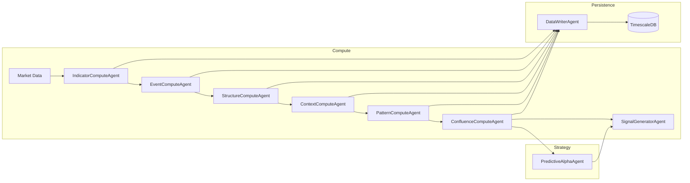

# Architectural Standard: Intelligence DAG Topology

## Overview
The IndicAgent pipeline is an event-driven, Agentic DAG (Directed Acyclic Graph). Data flows from raw market ticks through tiers of intelligence refinement, culminating in trading signals (I7) and predictive alpha strategies (I8+).

## DAG Topology Graph
The pipeline adheres to the "Tiered Pub, Unified Sub" model.

## Tiered Topic Registry

| Tier | Kafka Topic | Schema | Role |
| :--- | :--- | :--- | :--- |
| **I1** | `intelligence.i1.indicators` | `I1Indicators` | Technical features |
| **I2** | `intelligence.i2.events` | `I2Events` | Event triggers |
| **I3** | `intelligence.i3.structure` | `I3Structure` | Structural levels |
| **I4** | `intelligence.i4.context` | `I4Context` | Regime/Environment |
| **I5** | `intelligence.i5.patterns` | `I5Patterns` | Pattern recognition |
| **I6** | `intelligence.i6.confluence` | `I6Confluence` | Aggregated Signal Input |
| **I7** | `intelligence.i7.signals` | `RankedSignal` | Trade Fire / Decision |
| **I8** | `intelligence.i8.alpha` | `AlphaMultiplier` | Predictive Strategy |

## Principles of Connectivity
- **Locality:** All I1-I6 compute occurs in the `ComputeAgent` process space (memory-bus speed).
- **Decoupling:** Persistence and Inference (I8) happen out-of-process via Kafka journals.
- **Backpressure:** Agents communicate lag metrics via OTel; K8s HPA scales nodes autonomously based on consumer depth.
