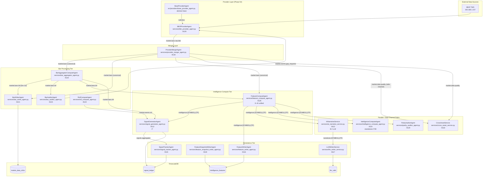

# Architectural Standard: Intelligence DAG Topology

Version: 2.1 (Phase 54 — Provider Abstraction Layer + full service inventory)
Last Updated: 2026-03-29

## Overview

The IndicAgent pipeline is an event-driven, Agentic DAG (Directed Acyclic Graph). Data flows from raw market data sources through a provider abstraction layer, bar aggregation tier, intelligence compute tiers (I1–I7), and finally into persistence. All inter-agent communication is via Redpanda (Kafka-compatible) topics. No agent communicates directly with another agent in process.

## Agent Taxonomy

Each agent has exactly one role, expressed in its class name suffix:

| Role Suffix | Responsibility | DB Access |
|-------------|---------------|-----------|
| `ProviderAgent` | External source → Kafka raw topic. No compute, no DB. | None |
| `MergerAgent` | Multi-source routing + auto-failover. DB-ignorant. | None |
| `ComputeAgent` | Math/stats transform. DB-ignorant. | None |
| `WriterAgent` | DB persistence only. | Write |
| `GeneratorAgent` | Signal/trade fire logic. | Write |
| `TrackerAgent` | Business object lifecycle management. | Read/Write |
| `AuditorAgent` | Data integrity validation + self-healing. | Read |

All agents extend `BaseAgent` (`src/core/agent/base.py`) and implement the `_setup → _run → _teardown` lifecycle with `SIGTERM` graceful drain.

## Full DAG Topology

## Primary Data Flow (Step by Step)

### 1. Provider Layer
`IBKRProviderAgent` connects to IBKR TWS and emits 1m bars to `market.bars.raw.ibkr`. It never writes to `market.bars` directly — that is the MergerAgent's exclusive responsibility. `BaseProviderAgent` (`src/providers/base_provider_agent.py`) provides lifecycle, metrics, exponential-backoff reconnect, and gap-fill handling. Additional providers would subclass `BaseProviderAgent` and publish to their own `market.bars.raw.<provider>` topic.

### 2. Merger Layer
`ProviderMergerAgent` subscribes to all `market.bars.raw.<provider>` topics and routes the authoritative provider's bars to the canonical `market.bars` topic. It implements auto-failover when the primary provider has been silent for `provider_silence_bars_threshold` bar intervals. A `ProviderQualityEvent` is published to `market.data.quality` on every routed bar, failover event, and recovery event.

`market.bars` is the single source of truth for all downstream consumers — they are completely isolated from provider topology changes.

### 3. Bar Processing Tier

| Agent | Input | Output | Purpose |
|-------|-------|--------|---------|
| `BarAggregatorComputeAgent` | `market.bars` (1m) | `market.bars.htf` | Aggregates 1m bars into 5m, 15m, 1h, 4h, 1d via `BarAccumulator` |
| `BarWriterAgent` | `market.bars` + `market.bars.htf` | `market_data_ohlcv` | Batch-writes all OHLCV bars to TimescaleDB |
| `BarAuditorAgent` | `market.bars.htf` | `market.events.gap_requests` | Detects gaps in bar sequences; emits gap fill requests |
| `RollComputeAgent` | `market.bars` | `market.events.roll` | Detects futures contract roll events |

### 4. Intelligence Compute Tier

`FeatureComputeAgent` subscribes to both `market.bars` (1m) and `market.bars.htf` (all HTF timeframes). Each incoming bar triggers a full I1–I6 compute pipeline run in memory. Output is published as `IntelligenceEvent` to `intelligence:{SYMBOL}:{TF}`.

`SignalGeneratorAgent` subscribes to `intelligence:{SYMBOL}:{TF}` and runs the I7 signal generation logic. It writes all signals (not just the winner) to `signal_ledger` and publishes the winning signal to `signals.aggregated`.

`IntelligenceComputeAgent` is a standalone alternative I7/I8 compute loop with its own `BarHistorySeeder` warmup. It runs independently and does not replace `FeatureComputeAgent` + `SignalGeneratorAgent`.

### 5. Persistence Tier

| Agent | Input | Output | Purpose |
|-------|-------|--------|---------|
| `FeatureWriterAgent` | `intelligence:{SYMBOL}:{TF}` | `intelligence_features` | Batch-writes full feature vectors (I1–I7 JSONB) |
| `FeatureSnapshotWriterAgent` | `intelligence:{SYMBOL}:{TF}` | `intelligence_features` | Snapshot writer for point-in-time feature captures (:9119) |
| `SignalTrackerAgent` | `signals.aggregated` | `signal_ledger` | Tracks signal lifecycle: activation, MAE/MFE, 8-class outcome |
| `LLMWriterService` | `llm.calls` | `llm_calls` | Writes LLM audit log; back-fills outcomes |

### 6. Parallel / Side-Channel Paths

| Service | Input | Purpose |
|---------|-------|---------|
| `CrossAssetService` | `market.data.quality` + cross-asset streams | Cross-asset spread dynamics; publishes to `development.cross_asset` (:9118) |
| `ParityAuditorAgent` | `intelligence:{SYMBOL}:{TF}` | Data integrity validation; detects feature vector parity gaps (:9120) |
| `AINarrativeService` | `intelligence:{SYMBOL}:{TF}` | I8 LLM narrative via Ollama; publishes to `narratives:{SYMBOL}:{TF}` (:9113) |
| `IntelligenceComputeAgent` | `intelligence:{SYMBOL}:{TF}` | Standalone alternative I7/I8 compute loop with `BarHistorySeeder` warmup (:9114) |

## Topic Registry

| Topic | Producer | Consumers | Content |
|-------|----------|-----------|---------|
| `market.bars.raw.ibkr` | `IBKRProviderAgent` | `ProviderMergerAgent` | Raw 1m bars from IBKR |
| `market.bars.raw.<provider>` | Any `ProviderAgent` subclass | `ProviderMergerAgent` | Raw bars per provider |
| `market.bars` | `ProviderMergerAgent` | `BarAggregatorComputeAgent`, `BarWriterAgent`, `FeatureComputeAgent`, `SignalGeneratorAgent` | Canonical 1m bars |
| `market.bars.htf` | `BarAggregatorComputeAgent` | `BarWriterAgent`, `BarAuditorAgent`, `FeatureComputeAgent`, `SignalGeneratorAgent` | Aggregated HTF bars (5m–1d) |
| `market.data.quality` | `ProviderMergerAgent` | `CrossAssetService`, observability consumers | Provider quality events (latency, failover, recovery) |
| `market.events.gap_requests` | `BarAuditorAgent` | `IBKRProviderAgent` (gap fill) | Gap fill requests |
| `market.events.roll` | `RollComputeAgent` | `SignalGeneratorAgent` | Futures roll events |
| `intelligence:{SYMBOL}:{TF}` | `FeatureComputeAgent` | `SignalGeneratorAgent`, `FeatureWriterAgent`, `FeatureSnapshotWriterAgent`, `AINarrativeService`, `IntelligenceComputeAgent`, `ParityAuditorAgent` | Full I1–I6 feature vectors per bar |
| `signals.aggregated` | `SignalGeneratorAgent` | `SignalTrackerAgent` | Winning ranked signals |
| `narratives:{SYMBOL}:{TF}` | `AINarrativeService` | `LLMWriterService` | LLM narrative analysis |
| `llm.calls` | `AINarrativeService` | `LLMWriterService` | Raw LLM call records |

All topic strings are constructed via `src/core/stream_keys.py` — never hardcoded.

## Service → Systemd Unit Map

| Service File | Class | Systemd Unit | Metrics Port |
|---|---|---|---|
| `services/ibkr_provider_agent.py` | `IBKRProviderAgent` | `indicagent-ibkr-provider` | :9129 |
| `services/provider_merger_agent.py` | `ProviderMergerAgent` | `indicagent-provider-merger` | :9130 |
| `services/bar_aggregator_agent.py` | `BarAggregatorComputeAgent` | `indicagent-bar-aggregator-compute` | :9120 |
| `services/bar_writer_agent.py` | `BarWriterAgent` | `indicagent-bar-writer` | :9121 |
| `services/bar_auditor_agent.py` | `BarAuditorAgent` | `indicagent-bar-auditor` | :9123 |
| `services/roll_compute_agent.py` | `RollComputeAgent` | `indicagent-roll-compute` | :9122 |
| `services/feature_compute_agent.py` | `FeatureComputeAgent` | `indicagent-feature-compute` | :9125 |
| `services/signal_generator_agent.py` | `SignalGeneratorAgent` | `indicagent-signal-generator` | :9112 |
| `services/intelligence_compute_agent.py` | `IntelligenceComputeAgent` | `indicagent-intelligence-compute` | :9114 |
| `services/ai_narrative_service.py` | `AINarrativeService` | `indicagent-ai-narrative` | :9113 |
| `services/feature_writer_agent.py` | `FeatureWriterAgent` | `indicagent-feature-writer` | :9116 |
| `services/feature_snapshot_writer_agent.py` | `FeatureSnapshotWriterAgent` | — | :9119 |
| `services/llm_writer_service.py` | `LLMWriterService` | `indicagent-llm-writer` | :9117 |
| `services/signal_tracker_agent.py` | `SignalTrackerAgent` | `indicagent-signal-tracker` | :9115 |
| `services/cross_asset_service.py` | `CrossAssetService` | — | :9118 |
| `services/parity_auditor_agent.py` | `ParityAuditorAgent` | — | :9120 (conflict — see note) |

> **Port :9120 conflict**: Both `BarAggregatorComputeAgent` and `ParityAuditorAgent` declare metrics port :9120. Resolve before running both simultaneously.

## Architectural Invariants

- **`ProviderMergerAgent` is the sole writer to `market.bars`.** All downstream consumers are isolated from provider topology changes. Adding or removing a provider requires no downstream changes.
- **I1–I6 runs entirely in-process.** `FeatureComputeAgent` computes all intelligence tiers in memory before publishing a single `IntelligenceEvent`. Kafka is a sink, not an inter-stage pipe.
- **No ComputeAgent touches the database.** Only `WriterAgent`, `GeneratorAgent`, and `TrackerAgent` subclasses perform DB operations.
- **All topic keys via `stream_keys.py`.** No hardcoded topic strings anywhere in service code.
- **Scaling via systemd + Prometheus lag.** No Kubernetes HPA. Consumer lag monitored via `persistence_consumer_lag` metric.
- **All timestamps UTC.** Every bar, event, and DB write uses timezone-aware UTC datetimes.
