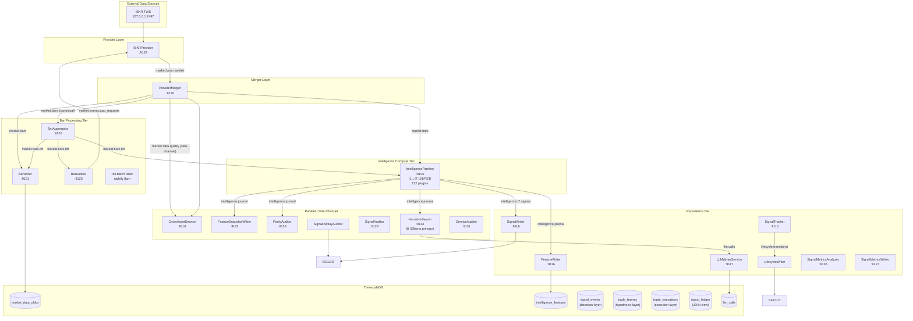

# DAG Topology & Methodology

**Version:** 2.8
**Status:** current
**Last Updated:** 2026-05-27
**Tags:** dag, agent-taxonomy, service-dag, topology, pipeline, orchestration

## Overview

The IndicAgent pipeline is an event-driven, Agentic DAG (Directed Acyclic Graph). Data flows from raw market data through a provider abstraction layer, bar aggregation tier, unified intelligence compute (I1–I7), and finally into persistence via Writers. All inter-agent communication is via Redpanda topics.

---

## Agent Taxonomy

Each agent has exactly one role, expressed in its class name suffix:

| Role Suffix | Responsibility | DB Access | Example |
|-------------|---------------|-----------|---------|
| `Provider` | External source → Kafka raw topic. No compute. | None | `IBKRProvider` |
| `Merger` | Multi-source routing + auto-failover. DB-ignorant. | None | `ProviderMerger` |
| Hot-path service | Math/stats transform. DB-ignorant. | None | `IntelligencePipeline` |
| Writer | DB persistence only. | Write | `FeatureWriter`, `SignalWriter` |
| `Tracker` | Business object lifecycle. | Read/Write | `SignalTracker` |
| `Auditor` | Data integrity validation + self-healing. | Read | `BarAuditor`, `ParityAuditor` |

All agents extend `BaseAgent` (`src/core/agent/base.py`). See `docs/agents/agents-foundation.md` for lifecycle contract.

---

## Full DAG Topology



---

## DAG Methodology

> **Why this matters:** Most systems tightly couple data providers to consumers, hardcode execution order, and mix compute with persistence. The IndicAgent DAG applies Separation of Concerns as an architectural invariant, not a coding guideline.

### 1. Provider Isolation

**Pattern:** `ProviderMerger` is the sole writer to `market.bars`.

- Providers publish to provider-specific topics (`market.bars.raw.<provider>`)
- Merger routes canonical bars to `market.bars`
- Downstream consumers are isolated from provider topology changes
- Adding/removing a provider requires zero downstream changes

**What this prevents:** In typical systems, changing from IBKR to Bloomberg requires modifying every service that consumes market data. In IndicAgent, add a `BloombergProvider` → publish to `market.bars.raw.bbg` → done. The Merger handles routing. Zero downstream changes.

**Why this matters:** Provider diversification becomes a configuration decision, not a development project.

### 2. In-Process Intelligence

**Pattern:** `IntelligencePipeline` runs I1→I7 entirely in-memory.

```
┌─────────────────────────────────────────────────────────────────────────┐
│              IntelligencePipeline (I1→I7)                  │
├─────────────────────────────────────────────────────────────────────────┤
│                                                                         │
│  market.bars → I1 (28 plugins) → tiered outputs                        │
│              → I2 (10 plugins) → tiered outputs                        │
│              → I3 (8 plugins) → tiered outputs                         │
│              → I4 (12 plugins) → tiered outputs                        │
│              → I5 (16 plugins) → tiered outputs                        │
│              → SMC (16 plugins) → tiered outputs                       │
│              → I6 (6 plugins) → confluence scores                      │
│              → I7 (36 plugins) → ranked signals                        │
│                                                                         │
│              ┌─────────────────────────────────────┐                   │
│              │   StreamMerger (Convergence Gate)   │                   │
│              └─────────────────────────────────────┘                   │
│                        ↓                         ↓                     │
│            intelligence.journal      intelligence.i7.signals            │
│                                                                         │
└─────────────────────────────────────────────────────────────────────────┘
```

**Key Points:**
- Kafka is a sink, not an inter-stage pipe
- No I6→I7 Kafka hop
- Async output buffering via `asyncio.Queue(maxsize=500)`
- Backpressure from Kafka doesn't block compute

**Why this matters:** Sub-10ms end-to-end latency enables real-time response to market movements that slower systems miss.

### 3. Convergence Gate (StreamMerger)

**Pattern:** All tiered outputs join into a single, unified journal entry before persistence.

```
intelligence.i1 (tiered JSONB) ──┐
intelligence.i3 (tiered JSONB) ──┤
intelligence.i4 (tiered JSONB) ──┼──→ StreamMerger → intelligence.journal
intelligence.smc (tiered JSONB) ──┘
```

**Purpose:** Atomic data integrity — no partial writes, no orphaned tiers.

**What this prevents:** In tiered systems that write separately, a crash after I1 but before I7 leaves orphaned partial state. Reconciliation requires complex error-prone logic.

**Why this matters:** Every bar produces exactly one `intelligence.journal` entry containing all tiers. Replay from offset 0 reconstructs complete state. Debugging is trivial — any bar = single entry.

### 4. Compute vs Persistence Separation

**Pattern:** Writers are the ONLY agents with DB write access.

```
Compute (DB-ignorant) → Kafka → Writer (DB access only)
```

| Agent | Reads | Writes | DB Access |
|-------|-------|--------|-----------|
| `IntelligencePipeline` | `market.bars` | Kafka topics | None |
| `FeatureWriter` | `intelligence.journal` | `intelligence_features` | Write |
| `SignalWriter` | `intelligence.i7.signals` | `signal_events + trade_frames` | Write |

**What this prevents:** Most systems mix compute and persistence — indicators write directly to DB. When DB slows down, indicators slow down. When DB goes down, indicators stop.

**Why this matters:** Compute agents don't know or care that persistence exists. They publish to Kafka and continue. Writers can batch, retry, or pause without affecting hot path.

### 5. Hot/Warm/Cold Tier Separation

| Tier | Technology | Latency | Purpose |
|------|------------|---------|---------|
| **Hot** | In-memory, asyncio.Queue | <10ms | Plugin execution, no blocking I/O |
| **Warm** | Redpanda topics | Sub-ms | Durable, replayable event bus |
| **Cold** | TimescaleDB batch | Async | Archival, ML training dataset |

---

## Primary Data Flow

### 1. Provider Layer
`IBKRProvider` connects to IBKR TWS at `127.0.0.1:7497` (Docker container) and emits 1m bars to `market.bars.raw.ibkr`. It never writes to `market.bars` directly — that is the Merger's exclusive responsibility.

### 2. Merger Layer
`ProviderMerger` subscribes to all `market.bars.raw.<provider>` topics and routes the authoritative provider's bars to `market.bars`. Auto-failover when primary is silent. A `ProviderQualityEvent` side-channel publishes latency, failover, and recovery events.

### 3. Bar Processing Tier

| Agent | Input | Output | Purpose |
|-------|-------|--------|---------|
| `BarAggregator` | `market.bars` (1m) | `market.bars.htf` | 1m → 5m/15m/1h/4h/1d aggregation |
| `BarWriter` | `market.bars` + `.htf` | `market_data_ohlcv` | Batch-write OHLCV to DB |
| `BarAuditor` | `market.bars.htf` | `market.events.gap_requests` | Gap detection |
| `roll-batch` timer (nightly 8pm) | calendar logic | `contract_metadata` | Futures roll detection + promotion |

### 4. Intelligence Compute

`IntelligencePipeline` subscribes to both `market.bars` (1m) and `market.bars.htf`. Each bar triggers a full I1–I7 pipeline run in-memory across 132 plugins. Output published to `intelligence.journal` (tiered JSONB) and `intelligence.i7.signals` (winner signal).

### 5. Persistence Tier

| Agent | Input | Output | Purpose |
|-------|-------|--------|---------|
| `FeatureWriter` | `intelligence.journal` | `intelligence_features` | Full I1-I7 vectors (ML training) |
| `SignalWriter` | `intelligence.i7.signals` | `signal_events + trade_frames` | All ranked I7 signals (3-table schema) |
| `SignalTracker` | `intelligence.i7.signals` | `lifecycle.transitions` | Lifecycle: activation, MAE/MFE, outcome |
| `LifecycleWriter` | `lifecycle.transitions` | `signal_events.status + trade_frames.frame_details` | Persists lifecycle updates |
| `LLMWriterService` | `llm.calls` | `llm_calls` | LLM audit log + outcome back-fill |

### 6. Parallel / Side-Channel

| Service | Input | Purpose |
|---------|-------|---------|
| `CrossAssetService` | `market.data.quality` + cross-asset streams | Spread dynamics |
| `ParityAuditor` | `intelligence.journal` | Data integrity validation |
| `NarrativeSwarm` | `intelligence.i7.signals` | I8 LLM narratives (Ollama-primary) |
| `SignalReplayAuditor` | DB poll | expires_at TTL expiry evaluation |

---

## Topic Registry

| Topic | Producer | Consumers | Content |
|-------|----------|-----------|---------|
| `market.bars.raw.ibkr` | `IBKRProvider` | `ProviderMerger` | Raw 1m bars |
| `market.bars.raw.<provider>` | Any `Provider` | `ProviderMerger` | Provider-specific bars |
| `market.bars` | `ProviderMerger` | Bar tier, Pipeline | Canonical 1m bars |
| `market.bars.htf` | `BarAggregator` | Bar tier, Pipeline | HTF bars (5m-1d) |
| `market.data.quality` | `ProviderMerger` | `CrossAssetService` | Provider quality events |
| `market.events.gap_requests` | `BarAuditor` | `IBKRProvider` | Gap fill requests |
| `market.events.roll` | `roll-batch` timer | Pipeline | Futures roll events |
| `intelligence.journal` | `IntelligencePipeline` | FeatureWriter, Narrative, Parity | Full I1-I7 tiered JSONB |
| `intelligence.i7.signals` | `IntelligencePipeline` | SignalWriter, Tracker | Winner I7 signal |
| `narratives` | `NarrativeSwarm` | `LLMWriterService` | I8 LLM analysis |
| `llm.calls` | `NarrativeSwarm` | `LLMWriterService` | LLM call records |

All topic strings constructed via `src/core/stream_keys.py` — never hardcoded.

---

## Service Inventory

**Data layer:**

| File | Class | Unit | Port |
|------|-------|------|------|
| `services/ibkr_provider_agent.py` | `IBKRProvider` | `indicagent-ibkr-provider` | :9129 |
| `services/provider_merger_agent.py` | `ProviderMerger` | `indicagent-provider-merger` | :9130 |
| `services/bar_aggregator_agent.py` | `BarAggregator` | `indicagent-bar-aggregator-compute` | :9120 |
| `services/bar_writer_agent.py` | `BarWriter` | `indicagent-bar-writer` | :9121 |
| `services/bar_auditor_agent.py` | `BarAuditor` | `indicagent-bar-auditor` | :9123 |
| `scripts/ops/roll/ops_roll_batch.py` | roll-batch timer | `indicagent-roll-batch` (timer, 8pm) | — |

**Intelligence layer:**

| File | Class | Unit | Port |
|------|-------|------|------|
| `services/intelligence_pipeline_agent.py` | `IntelligencePipeline` | `indicagent-intelligence-pipeline` | :9125 |
| `services/feature_writer_agent.py` | `FeatureWriter` | `indicagent-feature-writer` | :9116 |
| `services/feature_snapshot_writer_agent.py` | `FeatureSnapshotWriter` | `indicagent-feature-snapshot-writer` | :9132 |
| `services/signal_writer_agent.py` | `SignalWriter` | `indicagent-signal-writer` | :9119 |
| `services/signal_tracker_compute_agent.py` | `SignalTracker` | `indicagent-signal-tracker-compute` | :9115 |
| `services/lifecycle_writer_agent.py` | `LifecycleWriter` | `indicagent-lifecycle-writer` | — |
| `services/signal_metrics_compute_agent.py` | `SignalMetricsAnalyzer` | `indicagent-signal-metrics-compute` | :9126 |
| `services/signal_metrics_writer_agent.py` | `SignalMetricsWriter` | `indicagent-signal-metrics-writer` | :9127 |
| `services/narrative_group_compute_agent.py` | `NarrativeSwarm` | `indicagent-ai-narrative` | :9113 |
| `services/llm_writer_service.py` | `LLMWriterService` | `indicagent-llm-writer` | :9117 |
| `services/cross_asset_service.py` | `CrossAssetService` | `indicagent-cross-asset` | :9118 |

**Auditing & observability layer:**

| File | Class | Unit | Port |
|------|-------|------|------|
| `services/parity_auditor_agent.py` | `ParityAuditor` | `indicagent-parity-auditor` | :9133 |
| `services/signal_auditor_agent.py` | `SignalAuditor` | `indicagent-signal-auditor` | :9128 |
| `services/signal_replay_auditor_agent.py` | `SignalReplayAuditor` | `indicagent-signal-replay` | — |
| `services/service_auditor_agent.py` | `ServiceAuditor` | `indicagent-service-auditor` | :9131 |

**ML layer (timer-triggered):**

| File | Class | Unit | Port |
|------|-------|------|------|
| `services/ml_data_quality_agent.py` | `MLDataQualityAuditor` | `indicagent-ml-data-quality` (timer) | — |
| `services/ml_discovery_agent.py` | `MLDiscoveryAnalyzer` | `indicagent-ml-discovery` (timer) | — |
| `services/ml_orchestrator_agent.py` | `MLOrchestrator` | `indicagent-ml-orchestrator` (timer) | — |

**Swarm layer:**

| File | Class | Unit | Port |
|------|-------|------|------|
| `services/alpha_swarm_agent.py` | `AlphaSwarm` | `indicagent-alpha-swarm` | — |
| `services/lineage_writer_agent.py` | `LineageWriter` | `indicagent-lineage-writer` | — |

---

## Architectural Invariants

1. **`ProviderMerger` is the sole writer to `market.bars`.** All downstream consumers isolated from provider topology.

2. **I1–I7 runs entirely in-process.** `IntelligencePipeline` computes all 132 plugins in-memory before publishing. Kafka is a sink, not an inter-stage pipe.

3. **Hot-path services are DB-ignorant.** Only Writer, Tracker, and Auditor services touch the database.

4. **All topic keys via `stream_keys.py`.** No hardcoded topic strings.

5. **Scaling via systemd + Prometheus lag.** No Kubernetes HPA. Consumer lag monitored via `persistence_consumer_lag` metric.

6. **All timestamps UTC.** Every bar, event, and DB write uses timezone-aware UTC datetimes.

7. **OTel SDK only.** `prometheus_client` removed (Phase 83). All metrics via `src/observability/metrics.py`.

---

## See Also

- `docs/intelligence/intelligence-plugins.md` — Plugin protocol, InputSpec, tier lists
- `docs/agents/agents-foundation.md` — BaseAgent lifecycle contract and role taxonomy
- `docs/agents/agents-operations.md` — Service mesh, DAG topology, and operations
- `docs/foundation/design-principles.md` — Architectural design principles
