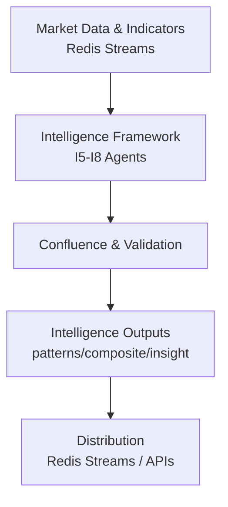

# AI Intelligence Architecture

**Version:** 2.2.0
**Last Updated:** 2026-02-12
**Status:** Historical Architecture Reference — I6-I8 are now operational (see STATUS.md). This doc captures the original design intent; the implemented architecture uses Ollama locally rather than LiteLLM/OpenRouter.

## Executive Summary

Comprehensive technical architecture for AI intelligence systems within IndicAgent. Provides sophisticated, modular foundation for market intelligence extraction that integrates seamlessly with existing infrastructure. Built on proven frameworks (LangGraph, LiteLLM, OpenRouter) with enterprise-grade observability, safety, and realistic deployment patterns.

**Core Mission:** Transform raw market data into actionable intelligence through multi-layer AI analysis, pattern recognition, and synthesis. I1-I8 are now operational (57 plugins). See `docs/STATUS.md` for current state.

## Scope and Non-Goals

### Scope
- AI intelligence architecture for I5–I8 tiers integrating with LangGraph event-driven workflows
- Agent coordination patterns with circuit breakers and enhanced monitoring
- Stream-based distribution with intelligence-aware messaging and observability

### Non-Goals
- Trading execution systems (orders, broker integration)
- UI implementation details (dashboards, component code)
- Strategy design/backtesting specifics

## Intelligence System Design Principles

### Intelligence-First Architecture
- Clean separation between intelligence extraction and analysis logic
- Pattern recognition and market structure analysis as primary capabilities
- Multi-layer intelligence processing (I1-I8 tiers) with clear data contracts

### Simplicity & Elegance
- Configuration-driven behavior with minimal hard-coding
- Standardized interfaces and communication protocols
- Consistent patterns across all agent implementations

### Sophisticated Analysis Framework
- Multi-timeframe confluence intelligence validation
- Cross-asset correlation and market regime detection
- Advanced pattern recognition with confidence scoring

### Infrastructure Integration
- Leverage existing Redis Streams, PostgreSQL/TimescaleDB, Docker services
- Integrate with hybrid service-plugin architecture for I5-I8 capabilities
- Maintain compatibility with existing observability and monitoring

## Intelligence Architecture Overview

### AI Intelligence Stack
```
AI Intelligence System Architecture:
├── Intelligence Runtime Layer
│   ├── Intelligence Agent Lifecycle (spawn, analyze, synthesize)
│   ├── LangGraph Intelligence Workflows (multi-agent coordination)
│   ├── Intelligence Bus (Redis streams, insight routing)
│   └── Resource Management (model pools, throttling, monitoring)
├── Intelligence Analysis Layer (I5-I8 Implementation)  
│   ├── Pattern Intelligence Agent (I5: technical patterns, market structure)
│   ├── Market Context Agent (I4: regime detection, volatility analysis)
│   ├── Confluence Agent (I6: multi-factor synthesis, confidence scoring)
│   ├── Smart Money Agent (I5: institutional flow, liquidity analysis)
│   └── Research Agent (context: news analysis, sentiment, economic data)
├── Intelligence Learning Layer
│   ├── Pattern Validation (prediction accuracy, intelligence quality)
│   ├── Confidence Calibration (accuracy tracking, threshold adjustment)
│   ├── Intelligence Evolution (success rate tracking, model adaptation)
│   └── Meta-Intelligence (learning optimization, capability development)
├── Intelligence Infrastructure Layer
│   ├── Data Integration (Redis Streams I1-I8, PostgreSQL, TimescaleDB)
│   ├── Observability (intelligence metrics, analysis tracing)
│   ├── Safety & Validation (pattern validation, confidence guardrails)
│   └── Deployment (Docker Compose, service discovery, health checks)
└── External Intelligence Layer
    ├── MCP Tools (brave-search, ref, semgrep for research)
    ├── AI/ML Services (OpenRouter, LiteLLM model routing)
    ├── Market Data (existing IBKR intelligence streams)
    └── Intelligence Interfaces (dashboard, WebSocket intelligence broadcasting)
```

### Architecture Flow (Simplified)



## Intelligence Agent Framework

### Base Intelligence Agent Interface
```python
class BaseIntelligenceAgent:
    """Foundation interface for all IndicAgent intelligence agents"""
    
    # Intelligence Capabilities (I-Tier Mapping)
    intelligence_capabilities: List[str] = [
        "pattern_recognition",      # I5: Technical patterns, market structure
        "market_context",          # I4: Regime detection, volatility assessment
        "confluence_synthesis",    # I6: Multi-factor intelligence combination
        "confidence_assessment",   # I6: Intelligence quality and reliability
        "predictive_intelligence"  # I7: Insight generation with uncertainty
    ]
    
    # Intelligence Processing States
    class IntelligenceState(Enum):
        ANALYZING = "analyzing"        # Processing market data for patterns
        SYNTHESIZING = "synthesizing"  # Combining multiple intelligence sources  
        VALIDATING = "validating"      # Confidence scoring and validation
        LEARNING = "learning"          # Pattern adaptation and improvement
        DORMANT = "dormant"           # Waiting for market conditions
    
    # Intelligence Configuration
    intelligence_config: IntelligenceConfig = Field(...)
    pattern_tracker: PatternPerformanceTracker = Field(...)
    confidence_validator: ConfidenceValidator = Field(...)
```

### Intelligence Processing Patterns

Multi-Timeframe Intelligence Confluence:
```yaml
# Intelligence confluence configuration
intelligence_processing:
  confluence_analysis:
    timeframes: ["1m", "5m", "15m", "1h", "4h", "1d"]
    confidence_weights:
      pattern_strength: 0.3
      multi_timeframe_agreement: 0.25
      volume_confirmation: 0.2
      market_context: 0.15
      historical_success: 0.1
  
  intelligence_thresholds:
    minimum_confidence: 0.7
    multi_timeframe_agreement: 0.8
    pattern_strength_threshold: 0.75
```

Smart Money Intelligence Detection:
```yaml
# Institutional flow analysis
smart_money_intelligence:
  institutional_indicators:
    - large_volume_analysis
    - dark_pool_flow_estimation
    - options_flow_correlation
    - futures_basis_analysis
  
  liquidity_intelligence:
    - fair_value_gap_detection
    - liquidity_sweep_identification
    - order_block_analysis
    - market_structure_shifts
```

## Intelligence Integration Patterns

### Redis Streams Intelligence Distribution
```python
# Intelligence stream architecture - use src/core/stream_keys.py helpers
from src.core.stream_keys import (
    features as sk_features,
    composite as sk_composite, 
    patterns as sk_patterns,
    regime as sk_regime,
    insights as sk_insights
)

intelligence_streams = {
    # I1 Raw Features
    "features": sk_features(env_prefix, symbol, timeframe),

    # I2–I7 Composite Intelligence  
    "composite": sk_composite(env_prefix, symbol, timeframe),

    # I5–I7 Pattern Intelligence
    "patterns": sk_patterns(env_prefix, symbol, timeframe),

    # I4 Market Context
    "regime": sk_regime(env_prefix, scope),  # scope: MARKET or SYMBOL:TF

    # I8 AI Intelligence (human-readable insights)
    "insights": sk_insights(env_prefix, symbol, timeframe)
}
```

**Critical Standards:**
- Always use `src/core/stream_keys.py` helpers to build stream names
- Never construct stream keys manually with f-strings
- Environment prefix is derived from `INDICAGENT_ENV` via Settings

### Intelligence Database Schema
```sql
-- Intelligence analysis storage
CREATE TABLE intelligence_analysis (
    id BIGSERIAL PRIMARY KEY,
    timestamp TIMESTAMPTZ NOT NULL,
    symbol VARCHAR(20) NOT NULL,
    timeframe VARCHAR(10) NOT NULL,
    intelligence_type VARCHAR(50) NOT NULL,
    analysis_data JSONB NOT NULL,
    confidence_score DECIMAL(5,4),
    intelligence_tier INTEGER, -- I1-I8 classification
    validation_status VARCHAR(20),
    created_at TIMESTAMPTZ DEFAULT NOW()
);

-- Pattern intelligence tracking
CREATE TABLE pattern_intelligence (
    id BIGSERIAL PRIMARY KEY,
    timestamp TIMESTAMPTZ NOT NULL,
    symbol VARCHAR(20) NOT NULL,
    timeframe VARCHAR(10) NOT NULL,
    pattern_type VARCHAR(100) NOT NULL,
    pattern_data JSONB NOT NULL,
    confidence_score DECIMAL(5,4),
    validation_outcome VARCHAR(20),
    performance_metrics JSONB,
    created_at TIMESTAMPTZ DEFAULT NOW()
);
```

## Intelligence Safety & Validation

### Intelligence Confidence Framework
- **Pattern Validation**: Historical success rate tracking
- **Multi-Timeframe Agreement**: Cross-timeframe pattern confirmation
- **Market Context Validation**: Regime-appropriate pattern recognition
- **Confidence Decay**: Time-based confidence degradation
- **Intelligence Quality Scoring**: Comprehensive reliability metrics

### Intelligence Guardrails
```python
class IntelligenceValidator:
    """Ensures intelligence quality and reliability"""
    
    def validate_intelligence(self, intelligence_output):
        validations = [
            self._validate_confidence_thresholds(intelligence_output),
            self._validate_market_context_appropriateness(intelligence_output),
            self._validate_multi_timeframe_consistency(intelligence_output),
            self._validate_pattern_historical_performance(intelligence_output),
            self._validate_data_quality_requirements(intelligence_output)
        ]
        return all(validations)
```

## Intelligence Development Roadmap

### Current Status: LangGraph Integration Complete - Pattern Detection Implementation
**LangGraph Integration Complete:** Event-driven workflow framework with circuit breakers and enhanced monitoring
**Plugin Framework Operational:** 11 registered plugins with hybrid plugin-legacy system operational
**Code Quality Optimized:** 83% improvement with automated cleanup (1,323 issues resolved)
**Current Focus:** Pattern detection systems (RSI divergence, Bollinger squeeze, volume analysis)

### Phase 1: Pattern Detection Systems (Current Sprint - 2-3 weeks)
- **RSI Divergence Engine** - Complement existing MACD divergence architecture
- **Bollinger Squeeze Detection** - High-probability breakout predictor
- **Volume Divergence Engine** - Price-volume disconnect analysis
- **Multi-Indicator Confluence** - Stack RSI+MACD+Stochastic+Volume for high-confidence signals

### Phase 2: Multi-Timeframe Integration (Next - 2 weeks)
- **Cross-Timeframe Confluence Engine** - Pattern validation across 1m→5m→15m→1h timeframes
- **Multi-Timeframe Pattern Analysis** - 90%+ false positive reduction through timeframe validation
- **Enhanced Dashboard Integration** - Real-time multi-timeframe pattern visualization

### Phase 3: AI Intelligence Integration (Future)
- **AI Intelligence Service (I8)** - OpenRouter LLM integration with cost controls
- **Smart Money Intelligence Agent** - Institutional flow detection and liquidity analysis
- **Mixture-of-Agents (MoA)** - Multi-agent orchestration patterns and intelligence synthesis

---

## Related Documentation

- [Comprehensive Intelligence Architecture](../architecture/comprehensive-intelligence-architecture.md)
- [Layered Architecture](../architecture/layered-architecture.md)
- [Intelligence Tiers](../architecture/intelligence-tiers.md)
- [Plugin Registry & DAG Execution](../architecture/plugin-registry-and-dag-execution.md)
- [Stream Schemas](../architecture/stream-schemas.md)
- [Market Intelligence Strategy](market-intelligence-strategy.md)
- [AI Intelligence Resources](ai-intelligence-resources.md)

This architecture provides the foundation for sophisticated market intelligence extraction while maintaining focus on analysis and insights rather than execution systems.