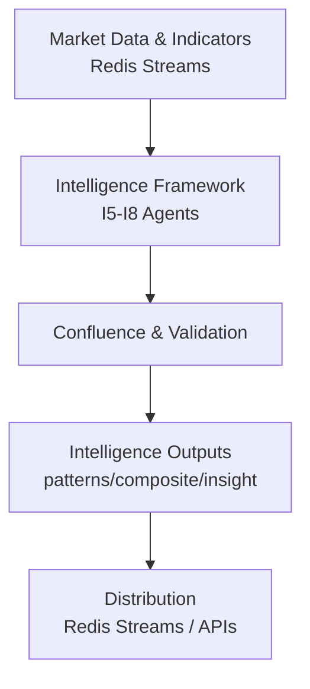

# AI Intelligence Architecture

**Version:** 3.0.0
**Last Updated:** 2026-03-02
**Status:** Operational — I1–I8 pipeline complete (84 plugins + 2 aggregation). LLM stack: ZAI GLM-5 (primary) → OpenRouter (fallback) → Ollama local (offline fallback). See `docs/STATUS.md` for full current state.

## Executive Summary

Comprehensive technical architecture for AI intelligence systems within IndicAgent. Provides sophisticated, modular foundation for market intelligence extraction that integrates seamlessly with existing infrastructure. The I8 AI Narrative layer uses a **3-tier LLM inference chain** — highest-quality cloud inference first, broad-model cloud fallback second, and always-available local inference as the last resort.

**Core Mission:** Transform raw market data into actionable intelligence through multi-layer AI analysis, pattern recognition, and synthesis. I1-I8 are operational (84 plugins). See `docs/STATUS.md` for current state.

## 3-Tier LLM Inference Chain (I8)

The `ai_narrative_service` (I8) uses `LLMChain` from `src/intelligence/llm_providers.py` — providers are tried in order and the first successful response is returned immediately.

```
Tier 1 (Primary)   — ZAI / GLM-5
                     State-of-the-art foundation model via Z.ai API.
                     Best reasoning quality; lowest-latency for complex market narratives.
                     Endpoint: https://api.z.ai/api/paas/v4/chat/completions
                     Env: ZAI_API_KEY, ZAI_MODEL (default: glm-5), ZAI_TIMEOUT_SEC

Tier 2 (Fallback)  — OpenRouter
                     Access to 100+ models from major providers (Llama, Mistral, Gemini,
                     Claude, etc.) through a single API. Free-tier models available.
                     Endpoint: https://openrouter.ai/api/v1
                     Env: OPENROUTER_API_KEY, OPENROUTER_TIMEOUT_SEC
                     Per-signal default: meta-llama/llama-3.3-70b-instruct:free
                     Group synthesis default: stepfun/step-3.5-flash:free

Tier 3 (Offline)   — Ollama (local)
                     Runs entirely on-device — always available even with no internet
                     or API access. Adds latency but guarantees narrative generation.
                     Endpoint: http://localhost:11434
                     Env: OLLAMA_BASE_URL, OLLAMA_TIMEOUT_SEC
                     Per-signal: qwen3:8b  |  Group synthesis: phi4-mini:3.8b
```

### Provider Chain Setup

```python
from src.intelligence.llm_providers import LLMChain, ZAIProvider, OpenRouterProvider, OllamaProvider

chain = LLMChain([
    ZAIProvider(model=settings.zai_model, api_key=settings.zai_api_key),
    OpenRouterProvider(model="meta-llama/llama-3.3-70b-instruct:free",
                       api_key=settings.openrouter_api_key),
    OllamaProvider(model="qwen3:8b", base_url=settings.ollama_base_url),
])
text = await chain.generate(prompt, system, max_tokens=500, timeout=30.0)
# chain.last_provider_id — which provider succeeded (e.g. "zai:glm-5")
```

### Adding a New Provider

Implement the `LLMProvider` protocol — one method, one attribute:

```python
class MyProvider:
    provider_id: str  # e.g. "myprovider:model-name"

    async def generate(self, prompt: str, system: str,
                       max_tokens: int, timeout: float) -> str | None:
        ...  # return text or None on failure
```

Add to `Settings` with `*_api_key`, `*_base_url`, `*_model`, `*_timeout_sec` fields, then insert into the chain at the desired priority position.

## Scope and Non-Goals

### Scope
- AI intelligence architecture for I5–I8 tiers integrating with LangGraph event-driven workflows
- Agent coordination patterns with circuit breakers and enhanced monitoring
- Stream-based distribution with intelligence-aware messaging and observability

### Non-Goals
- Trading execution systems (orders, broker integration)
- UI implementation details (dashboards, component code)
- Strategy design/backtesting specifics

## Intelligence System Design Principles

### Intelligence-First Architecture
- Clean separation between intelligence extraction and analysis logic
- Pattern recognition and market structure analysis as primary capabilities
- Multi-layer intelligence processing (I1-I8 tiers) with clear data contracts

### Simplicity & Elegance
- Configuration-driven behavior with minimal hard-coding
- Standardized interfaces and communication protocols
- Consistent patterns across all agent implementations

### Sophisticated Analysis Framework
- Multi-timeframe confluence intelligence validation
- Cross-asset correlation and market regime detection
- Advanced pattern recognition with confidence scoring

### Infrastructure Integration
- Leverage existing Redis Streams, PostgreSQL/TimescaleDB, Docker services
- Integrate with hybrid service-plugin architecture for I5-I8 capabilities
- Maintain compatibility with existing observability and monitoring

## Intelligence Architecture Overview

### AI Intelligence Stack
```
AI Intelligence System Architecture:
├── Intelligence Runtime Layer
│   ├── Intelligence Agent Lifecycle (spawn, analyze, synthesize)
│   ├── LangGraph Intelligence Workflows (multi-agent coordination)
│   ├── Intelligence Bus (Redis streams, insight routing)
│   └── Resource Management (model pools, throttling, monitoring)
├── Intelligence Analysis Layer (I5-I8 Implementation)  
│   ├── Pattern Intelligence Agent (I5: technical patterns, market structure)
│   ├── Market Context Agent (I4: regime detection, volatility analysis)
│   ├── Confluence Agent (I6: multi-factor synthesis, confidence scoring)
│   ├── Smart Money Agent (I5: institutional flow, liquidity analysis)
│   └── Research Agent (context: news analysis, sentiment, economic data)
├── Intelligence Learning Layer
│   ├── Pattern Validation (prediction accuracy, intelligence quality)
│   ├── Confidence Calibration (accuracy tracking, threshold adjustment)
│   ├── Intelligence Evolution (success rate tracking, model adaptation)
│   └── Meta-Intelligence (learning optimization, capability development)
├── Intelligence Infrastructure Layer
│   ├── Data Integration (Redis Streams I1-I8, PostgreSQL, TimescaleDB)
│   ├── Observability (intelligence metrics, analysis tracing)
│   ├── Safety & Validation (pattern validation, confidence guardrails)
│   └── Deployment (Docker Compose, service discovery, health checks)
└── External Intelligence Layer
    ├── MCP Tools (brave-search, ref for research)
    ├── AI/ML Services (ZAI GLM-5 → OpenRouter → Ollama local — 3-tier chain)
    ├── Market Data (existing IBKR intelligence streams)
    └── Intelligence Interfaces (dashboard, SSE intelligence broadcasting)
```

### Architecture Flow (Simplified)



## Intelligence Agent Framework

### Base Intelligence Agent Interface
```python
class BaseIntelligenceAgent:
    """Foundation interface for all IndicAgent intelligence agents"""
    
    # Intelligence Capabilities (I-Tier Mapping)
    intelligence_capabilities: List[str] = [
        "pattern_recognition",      # I5: Technical patterns, market structure
        "market_context",          # I4: Regime detection, volatility assessment
        "confluence_synthesis",    # I6: Multi-factor intelligence combination
        "confidence_assessment",   # I6: Intelligence quality and reliability
        "predictive_intelligence"  # I7: Insight generation with uncertainty
    ]
    
    # Intelligence Processing States
    class IntelligenceState(Enum):
        ANALYZING = "analyzing"        # Processing market data for patterns
        SYNTHESIZING = "synthesizing"  # Combining multiple intelligence sources  
        VALIDATING = "validating"      # Confidence scoring and validation
        LEARNING = "learning"          # Pattern adaptation and improvement
        DORMANT = "dormant"           # Waiting for market conditions
    
    # Intelligence Configuration
    intelligence_config: IntelligenceConfig = Field(...)
    pattern_tracker: PatternPerformanceTracker = Field(...)
    confidence_validator: ConfidenceValidator = Field(...)
```

### Intelligence Processing Patterns

Multi-Timeframe Intelligence Confluence:
```yaml
# Intelligence confluence configuration
intelligence_processing:
  confluence_analysis:
    timeframes: ["1m", "5m", "15m", "1h", "4h", "1d"]
    confidence_weights:
      pattern_strength: 0.3
      multi_timeframe_agreement: 0.25
      volume_confirmation: 0.2
      market_context: 0.15
      historical_success: 0.1
  
  intelligence_thresholds:
    minimum_confidence: 0.7
    multi_timeframe_agreement: 0.8
    pattern_strength_threshold: 0.75
```

Smart Money Intelligence Detection:
```yaml
# Institutional flow analysis
smart_money_intelligence:
  institutional_indicators:
    - large_volume_analysis
    - dark_pool_flow_estimation
    - options_flow_correlation
    - futures_basis_analysis
  
  liquidity_intelligence:
    - fair_value_gap_detection
    - liquidity_sweep_identification
    - order_block_analysis
    - market_structure_shifts
```

## Intelligence Integration Patterns

### Redis Streams Intelligence Distribution
```python
# Intelligence stream architecture - use src/core/stream_keys.py helpers
from src.core.stream_keys import (
    features as sk_features,
    composite as sk_composite, 
    patterns as sk_patterns,
    regime as sk_regime,
    insights as sk_insights
)

intelligence_streams = {
    # I1 Raw Features
    "features": sk_features(env_prefix, symbol, timeframe),

    # I2–I7 Composite Intelligence  
    "composite": sk_composite(env_prefix, symbol, timeframe),

    # I5–I7 Pattern Intelligence
    "patterns": sk_patterns(env_prefix, symbol, timeframe),

    # I4 Market Context
    "regime": sk_regime(env_prefix, scope),  # scope: MARKET or SYMBOL:TF

    # I8 AI Intelligence (human-readable insights)
    "insights": sk_insights(env_prefix, symbol, timeframe)
}
```

**Critical Standards:**
- Always use `src/core/stream_keys.py` helpers to build stream names
- Never construct stream keys manually with f-strings
- Environment prefix is derived from `INDICAGENT_ENV` via Settings

### Intelligence Database Schema
```sql
-- Intelligence analysis storage
CREATE TABLE intelligence_analysis (
    id BIGSERIAL PRIMARY KEY,
    timestamp TIMESTAMPTZ NOT NULL,
    symbol VARCHAR(20) NOT NULL,
    timeframe VARCHAR(10) NOT NULL,
    intelligence_type VARCHAR(50) NOT NULL,
    analysis_data JSONB NOT NULL,
    confidence_score DECIMAL(5,4),
    intelligence_tier INTEGER, -- I1-I8 classification
    validation_status VARCHAR(20),
    created_at TIMESTAMPTZ DEFAULT NOW()
);

-- Pattern intelligence tracking
CREATE TABLE pattern_intelligence (
    id BIGSERIAL PRIMARY KEY,
    timestamp TIMESTAMPTZ NOT NULL,
    symbol VARCHAR(20) NOT NULL,
    timeframe VARCHAR(10) NOT NULL,
    pattern_type VARCHAR(100) NOT NULL,
    pattern_data JSONB NOT NULL,
    confidence_score DECIMAL(5,4),
    validation_outcome VARCHAR(20),
    performance_metrics JSONB,
    created_at TIMESTAMPTZ DEFAULT NOW()
);
```

## Intelligence Safety & Validation

### Intelligence Confidence Framework
- **Pattern Validation**: Historical success rate tracking
- **Multi-Timeframe Agreement**: Cross-timeframe pattern confirmation
- **Market Context Validation**: Regime-appropriate pattern recognition
- **Confidence Decay**: Time-based confidence degradation
- **Intelligence Quality Scoring**: Comprehensive reliability metrics

### Intelligence Guardrails
```python
class IntelligenceValidator:
    """Ensures intelligence quality and reliability"""
    
    def validate_intelligence(self, intelligence_output):
        validations = [
            self._validate_confidence_thresholds(intelligence_output),
            self._validate_market_context_appropriateness(intelligence_output),
            self._validate_multi_timeframe_consistency(intelligence_output),
            self._validate_pattern_historical_performance(intelligence_output),
            self._validate_data_quality_requirements(intelligence_output)
        ]
        return all(validations)
```

## Current Status (as of v5.10.0)

**All phases complete.** I1–I8 pipeline operational with 84 plugins + 2 aggregation components.

| Layer | Status |
|-------|--------|
| I1 Technical Indicators (23) | ✅ Running — incremental `compute_next()` |
| I2 Composite Events (5) | ✅ Running — MACD/RSI/Stochastic/ADX/Volume events |
| I3 Market Structure (7) | ✅ Running — swing, S/R, trend, VWAP, Fibonacci |
| I4 Context / Regime (7) | ✅ Running — GARCH, Kalman, MTF volatility |
| I5 Patterns (14) | ✅ Running — chart patterns, divergence, squeeze |
| I6 SMC + Confluence (14) | ✅ Running — BOS/CHoCH, FVG, order blocks, cross-TF |
| I7 Trading Setups (14+2) | ✅ Running — 14 setup plugins + signal aggregator + CIS |
| I8 AI Narrative (1) | ✅ Running — ZAI GLM-5 → OpenRouter → Ollama chain |

**See** `.planning/ROADMAP.md` for the next milestone backlog.

---

## Related Documentation

- [Comprehensive Intelligence Architecture](../architecture/comprehensive-intelligence-architecture.md)
- [Layered Architecture](../architecture/layered-architecture.md)
- [Intelligence Tiers](../concepts/intelligence-tiers.md)
- [Plugin Registry & DAG Execution](../architecture/plugin-registry-and-dag-execution.md)
- [Stream Schemas](../architecture/stream-schemas.md)
- [Market Intelligence Strategy](market-intelligence-strategy.md)
- [AI Intelligence Resources](ai-intelligence-resources.md)

This architecture provides the foundation for sophisticated market intelligence extraction while maintaining focus on analysis and insights rather than execution systems.